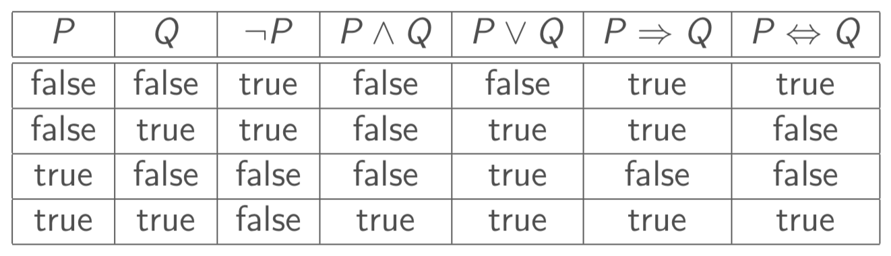
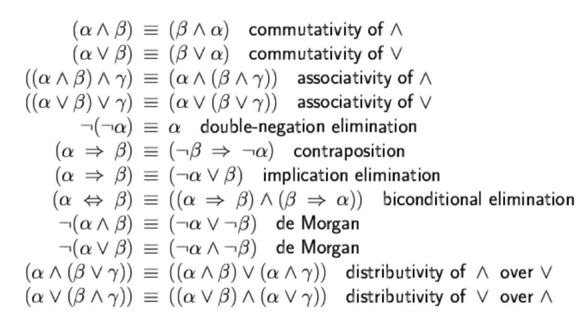
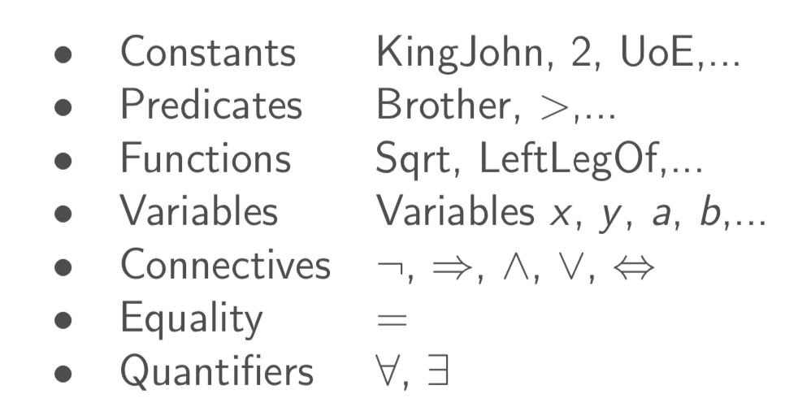
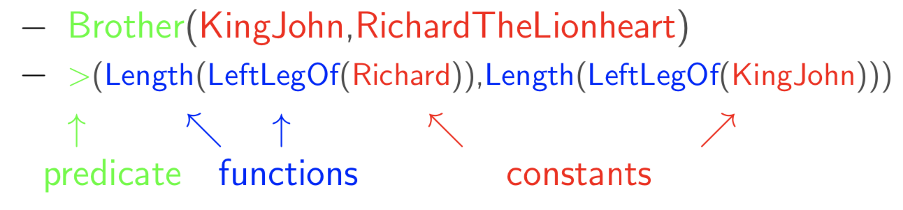
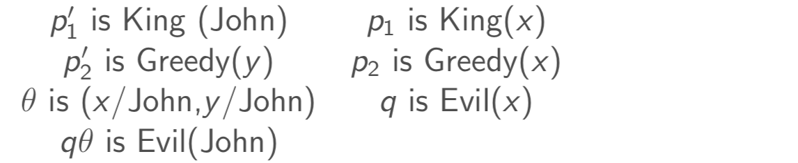
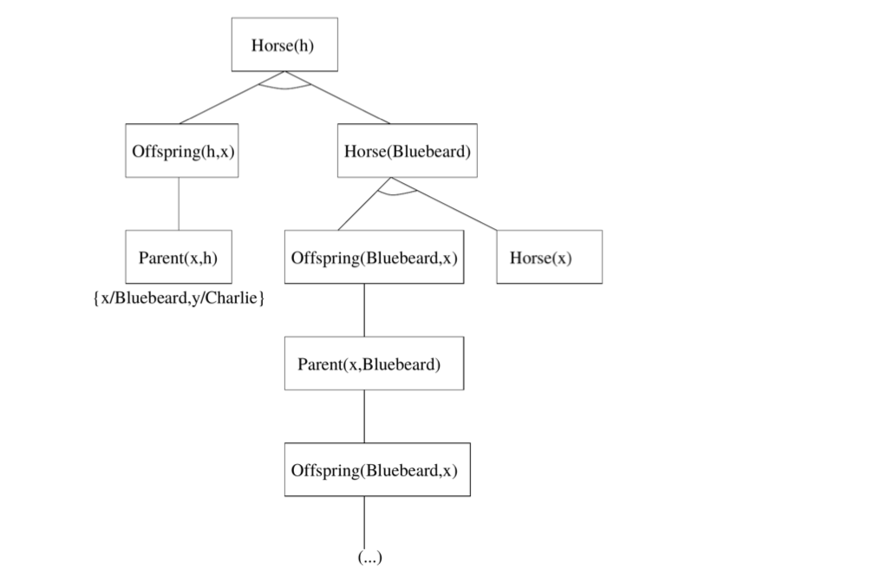

#A runmarkdown of logic

##Propositional Logic - PL

- Pros:

    - [x] Simple
    - [x] Declaritive
    - [x] Allows partial/disjunctive/negated info

- Cons:

    ❌ Limited expressive power

    ❌ Unlike natural language

- Main logic used in C&L

- Sentence: construction of lots of literals

    
    
    

- DPLL Alogirthm 
    1. Convert all propositions to CNF
    2. Make any pure literals true and unit cluases to true
        1. If there are no more simplifications then you must pick a literal and branch on it (I.e. choose a variable and assign it to true/false to remove clauses)
    3. Repeat step 2 till there are no more remaining clauses
        1. Return the variables that you assigned a value for, if there are still 'free' variables remaining then they can be either true or false and the sentence will still be true

---

##FIRST ORDER LOGIC - FOL

- Pros
    - [x] Can be used for natural language
    - [x] Allows expression of
        - Objects [people, houses, numbers, colours]
        - Relations [red, round, prime, brother of]
        - Functions [Father of, best friend, plus, greater than]
- Formulae are mapped to an interpretation
- **Skolemization** is a way of removing existential quantifiers from a formula
- **Definite clause** is a clause with only one positive literal
- **Model** is an interpretation of a model when all formulae in the model are true
- **Universal Quantification** is always used with implication
    -  $∀x.At(x,UoE) ⇒ Smart(x)$ = Everyone who is at UoE is smart
- **Existential Quantification** is always used with ∧
    - $∀x.At(x,UoE) ∧ Smart(x)$ = Everyone is at UoE and everyone is smart
- **Equality** (term1=term2) can be used if term1 and term2 refer to the same object

######Examples:

- One's mother is on'es female parent
    - $∀x,y.Mother(c) = m ⇔ (Female(m) ∧ Parent(m,c))$ 
- The best score in Greek is always higher than the best score in French
    - $∀x.GreaterThan(BestScore(x,Greek), BestScore(x,French))$ 
- There is a male barber who shaves all the men who do not shave themselves
    - $∃x.(Male(x) ∧ Barber(x)) ∧ ∀y.(Male(y) ∧ ¬Shaves(y,y)) ⇒ Shaves(x,y)  $ 

- Construct a sentence such that every world in which it is true contains exactly one object
    - $∀x.P(x) ∧ ¬∃x.x ≠ A ∧ P(A)$ 
        - To describe the above, this means that for all objects property P holds and there are no objects not equal to A such that P holds. Thus when the sentence is true then there can only be one object, A, in the domain of interpretation
    - $∀x.∃y.x=y$

###Most General Unifier - MGU

- Where you apply a subsititution of literals between two statements to end up with the same clause (a union of two clauses)

###### Examples:

- $p(a,B,B) $ and $p(x,y,z)$
    - $x/A, y/B, z/B = p(a,B,B)$

- $q(y,g(A,B))$ and $q(g(x,x),y)$
    - Unification fails (short answer: y is appearing contradicting places across multiple clauses). You can see this if you try sub $y/g(x,x)$ and $x/A$ which gives: $q(g(A,A),g(A,B))$ and $q(g(A,A),g(A,A))$ where we cannot go any futher from as $q(A,A)$ cannot be unified with $q(A,B)$ 
- $Older(father(y),y)$ and $Older(father(x),John)$
    - $x/John, y/John = Older(father(John), John)$

- $knows(father(y),y)$ and $knows(x,x)$
    - Unification fails as the second clause is the same literal twice yet the first clause has differing literals, one of which creates recursion upon unification

### Generalised Modus Ponens - GMP

$\frac{p_1 ',p_2 ',...p_n '(p_1  ∧ p_2 ∧…∧p_n  ⇒ q))} {qθ}$ when $p_i'θ ≡ p_iθ ∀i$ 

######Example

###Forwards Chaining - FC

- Starting with the given clauses in the KB and using inference rules to derive the goal clause
- Sound and complete for definite clauses (clause with one positive literal)

### Backwards Chaining - BC

- usually done in the way of a tree where the root node is the given clause
- The subbsequent vertex are what implies the parent vertex

###### Example

For the clause $Horse(h)$ with first order logic formulae

- $Horse(x) ⇒ Mammal(x)$
- $Horse(Bluebeard)$
- $Offspring(y,x) ∧ Horse(x) ⇒ Horse(y)$
- $Offspring(x,y) ⇔ Parent(y,x)$

You would get the backward chaining tree from the initial clause $Horse(h)$ of 

###Resolution

1. Translate the premise and conclusion into First Order Logic
2. Negate the conclusion (query)
3. Convert everything to CNF
4. Choose clauses and resolve
5. If resolution results in empty clause then conclusion is proved

### Situation Calculus

- Each predicate now has to also consider the "situation"
    - Eg.
        - Instead of $On(A,B)$ it would be $On(A,B,S_0)$
        - Or Add a new function $Holds(On(A,B),S_0)$
- Actions represent:
    - Conditions that need to be in place to perform an action
    - Results of doing an action
    - In an action $Poss()$ is used to describe the possibility of an outcome
    - $Result(X)$ is used as a place holder to show that the outcome of $X$ is what will be used in place of $Result(X)$ 
- Frame axioms are used to express that everything that isn't changed by an action stays the same
- Succesor-state axioms are used to express all the ways in which the value of a particular fluent can be changed (i.e. on the left side of the $⇔$ you have the value that can be changed in the form $(Value(Result(action, situation)))$ and on the right side you have all things which must be true before the action such that the result of the $action$ gives the $Value$ as true

###### Example

- Given the predicates

    - $At(sq,s)$ - the agent is at square $sq$ in situation $s$

    - $Heading(dir,s)$ - the agent is facing in direction $dir$ in situation $s$
    - $Newdir(dir_1,x,dir_2)$ - $dir_2$ is the new direction the agent will face if it is facing in direction $dir_1$ and turns $x ∈ \{Right, Left\}$
    - $Turn(x)$ - The action of turning $x$ where $x ∈ \{Right, Left\}$

    A precondition and effect axiom for the wumpus world that best describes the action $Turn(X)$ would be

    - Precondition: $Heading(dir_1,s) ∧ Newdir(dir_1,x,dir_2) ⇒ Poss(Turn(x), s)$
    - Effect: $Poss(Turn(x),s) ⇒ Heading(dir_2,Result(Turn(x),s))$

    A frame axiom would look like:

    - $At(sq_1,s) ∧ Heading(dir,s) ∧ Next(sq_1,dir,sq_2) ∧ Wumpus(sq_3,s) ∧ sq_2 ≠ sq_3 ⇒ Wumpus(sq_3,result(Shoot,s))$
    - Where this means that if the agent is in $sq_1$ and is heading in direction $dir$ where the next square is $sq_2$ in that direction but the wumpus is in $sq_3$ then the wumpus will remain unchanged regardless of the outcome of$ Shoot()$

- Another way of expressing an action is to have it all on the one line and miss the middle $Poss()$ step. E.g. for the predicates:

    - $L_{ij}$ - The hunter is in square (i,j) in situation s
    - $W_{ij}$ Wumpus is in square (i,j) in situation s
    - $HasArrow(s)$ - Hunter has an arrow in situation s
    - $FacingEast(s)$ - Hunter is facing east in situation s
    - $FacingNorth(s) $ - Hunter is facing north in situation s
    - $Turn(Left)$ - action of turning left in situation s
    - $WumpusAlive(s)$ - the Wumpus is alive in situation s
    - $Shoot$ - the action of shooting an arrow in situation s
    - $Forward$ - moving forward in situation s

    An effect axiom that describes how turning left when facing east affect location and direction:

    - $∀i,j,s.L_{ij} ∧ FacingEast(s) ⇒ L_{ij}(Result(Turn(Left)), s) ∧ FacingNorth(Result(Turn(Left)), s)$

    A frame axiom that captures how this action does not affect whether the hunter has her arrow:

    - $∀s.HasArrow(s) ⇒ HasArrow(Result(Turn(Left)), s)$

    A succesor state action for $HasArrow$ would be:

    - $∀a,s.HasArrow(Result(a,s)) ⇔ a ≠ Shoot ∧ HasArrow(s)$ 

    A successor-state action for $WumpusAlive$ would be

    - $∀a,s.WumpusAlive(Result(a,s)) ⇔ (a ≠ Shoot ∧ WumpusAlive(s)) ∨ (WumpusAlive(s) ∧ a = Shoot ∧ ¬(∃i,j,i',j' FacingNorth(s) ∧ (L_{ij}(s) ∧ W_{i'j'}(s) ∧ i = i' ∧ j'>j))$  

        